title: V8 上的 JS
speaker: junhaoxian


<slide class="bg-white aligncenter">
# **V8引擎 与 Javacript**

<slide class="bg-white aligncenter">
# **习惯 > 优化**

<slide class="bg-white aligncenter">
## **对象 -- Object** {.animated.fadeInUp.delay-200 }
## **数组 -- Array** {.animated.fadeInUp.delay-400}
## **方法 -- Function** {.animated.fadeInUp.delay-800}

<slide class="bg-white aligncenter">
# **对象 -- Object**

<slide class="bg-white size-80 aligncenter">
## **谁快？快多少？**
---

``` javascript
for (let i = 0; i < 10000000; ++i) {
  const user = {};
  user['name'] = `Mr.${i}`;
  user['age'] = i;
  user['isGoodMan'] = true;
}
```
---

``` javascript
for (let i = 0; i < 10000000; ++i) {
  const user = {};
  user[`name${i}`] = `Mr.${i}`;
  user[`age${i}`] = i;
  user[`isGoodMan${i}`] = true;
}
```

<slide class="bg-white aligncenter">
## **V8引擎 -- 如何描述 -- JSObject**

<slide class="bg-white aligncenter">
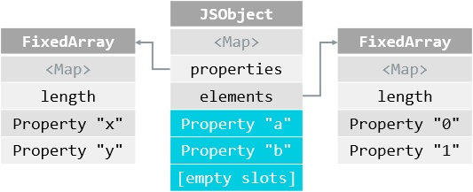

---

* #### **结构描述器（\<Map\>）**{.animated.fadeInUp.delay-100 }
* #### **对象内属性（inobject_properties）**{.animated.fadeInUp.delay-300 }
* #### **对象外属性（properties）**{.animated.fadeInUp.delay-500 }
* #### **数字式属性（elements）**{.animated.fadeInUp.delay-700 }

<slide class="bg-white size-80 aligncenter">
## **properties 与 elements**
---

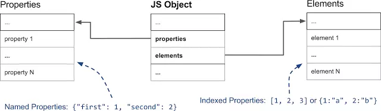

<slide class="bg-white size-50 aligncenter">
### **properties 与 elements**
---

``` javascript
const obj = {};
```
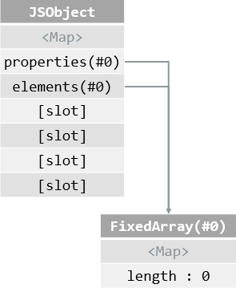


<slide class="bg-white size-50 aligncenter">
### **properties 与 elements**
---

``` javascript
const obj = {};

obj.x = 1;
obj.y = 2;
obj.z = 3;
```
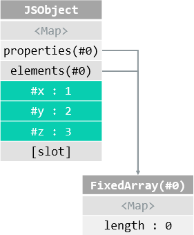

<slide class="bg-white size-50 aligncenter">
### **properties 与 elements**
---

``` javascript
const obj = {};

obj.x = 1;
obj.y = 2;
obj.z = 3;

obj[0] = "a";
obj[1] = "b";
```
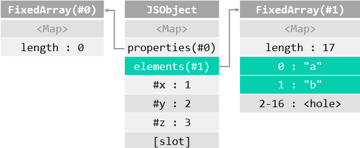

<slide class="bg-white size-50 aligncenter">
### **properties 与 elements**
---

``` javascript
const obj = {};

obj.x = 1;
obj.y = 2;
obj.z = 3;

obj[0] = "a";
obj[1] = "b";

obj.a = "a";
obj.b = "b";
obj.c = "c";
```
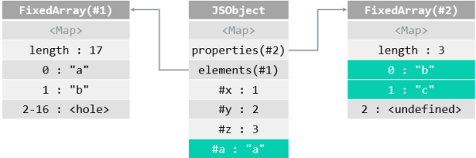

<slide class="bg-white size-80 aligncenter">
# **结构描述器（\<Map\>） -- 隐藏类**

<slide class="bg-white size-80 aligncenter">
### **结构描述器（\<Map\>） -- 隐藏类**
---
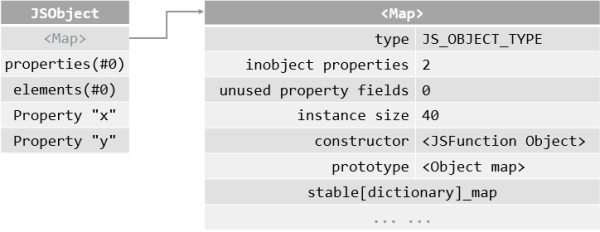

<slide class="bg-white size-80 aligncenter">
### **结构描述器（\<Map\>） -- 隐藏类**
---

#### **字典模式：instance_descriptors**
---

``` javascript
const obj = {}
obj.x = 1;
obj.y = 2;
obj.z = 3;
```

---

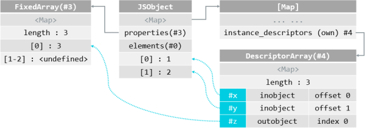

<slide class="bg-white size-80 aligncenter">
### **结构描述器（\<Map\>） -- 隐藏类**
---

#### **快速模式：instance_descriptors + raw_transitions**
---

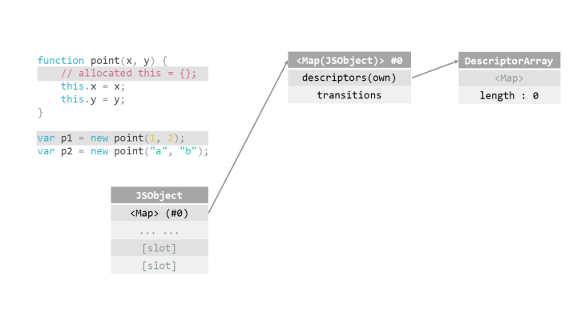

<slide class="bg-white size-80 aligncenter">
### **结构描述器（\<Map\>） -- 隐藏类**
---
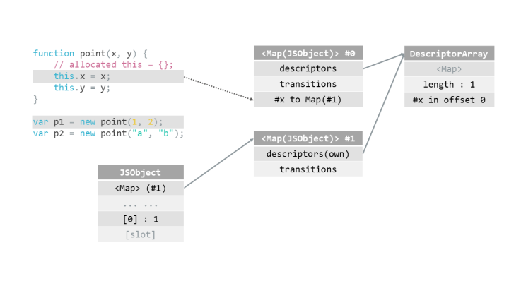

<slide class="bg-white size-80 aligncenter">
### **结构描述器（\<Map\>） -- 隐藏类**
---
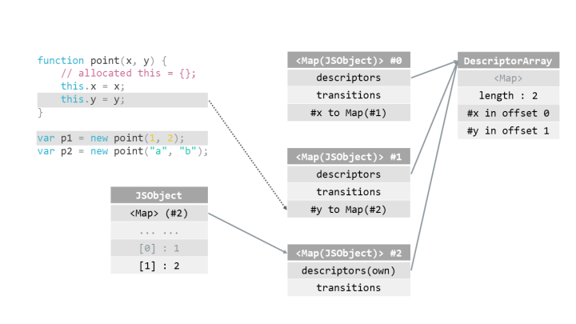

<slide class="bg-white size-80 aligncenter">
### **结构描述器（\<Map\>） -- 隐藏类**
---
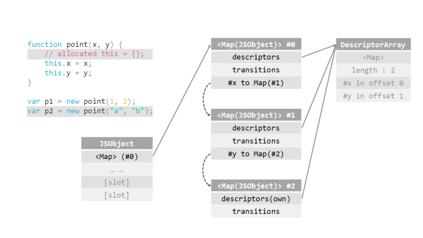

<slide class="bg-white size-80 aligncenter">
### **结构描述器（\<Map\>） -- 隐藏类**
---


<slide class="bg-white size-80 aligncenter">
### **结构描述器（\<Map\>） -- 隐藏类**
---
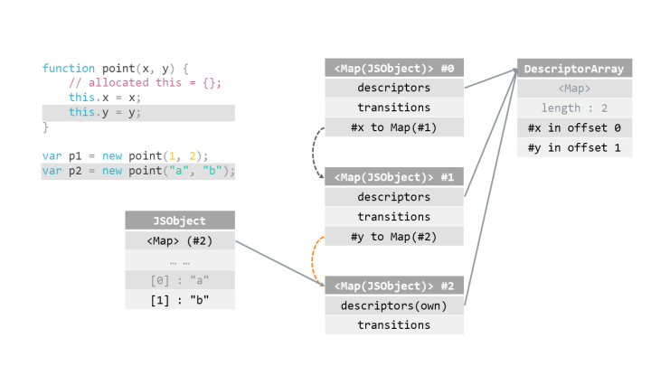

<slide class="bg-white size-80 aligncenter">
### **结构描述器（\<Map\>） -- 隐藏类**
---
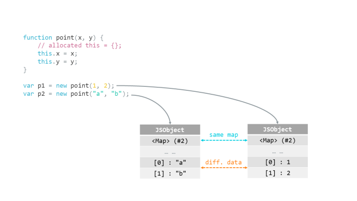

<slide class="bg-white size-80 aligncenter">
### **结构描述器（\<Map\>） -- 隐藏类**
---
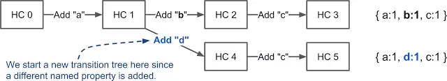

<slide class="bg-white size-80 aligncenter">
## **回到开始**
---

``` javascript
for (let i = 0; i < 10000000; ++i) {
  const user = {};
  user['name'] = `Mr.${i}`;
  user['age'] = i;
  user['isGoodMan'] = true;
}
```
---

``` javascript
for (let i = 0; i < 10000000; ++i) {
  const user = {};
  user[`name${i}`] = `Mr.${i}`;
  user[`age${i}`] = i;
  user[`isGoodMan${i}`] = true;
}
```

<slide class="bg-white aligncenter">
# **Object 总结和建议**
---

* #### 结构相同的对象有相同的 HiddenClasses {.animated.fadeInUp.delay-200}
---

*  #### 尽量保持相同的属性顺序 {.animated.fadeInUp.delay-400 }
*  #### 尽量不动态添加属性 {.animated.fadeInUp.delay-400 }

<slide class="bg-white aligncenter">
# **数组 -- Array**

<slide class="bg-white size-50 aligncenter">
# **数组排序 -- sort**
---

``` javascript
const arr = [];
for (let i = 0; i < 10; ++i) {
  arr.push({
    id: i,
    score: 10
  });
}
arr.sort((a, b) => a.score > b.score);
```
---


``` javascript
const arr = [];
for (let i = 0; i < 11; ++i) {
  arr.push({
    id: i,
    score: 10
  });
}
arr.sort((a, b) => a.score > b.score);
```

<slide class="bg-white size-50 aligncenter">
# **数组排序 -- sort**
---

* #### 数组数量小于等于10个 -- 插入排序
* #### 数组数量小于等于10个 -- 快速排序

<slide class="bg-white size-80 aligncenter">
# **数组 -- 连续 or 缺省**
---

``` javascript
const LIMIT = 100000000;

const arr1 = [];
for (let i = 0; i < LIMIT; ++i) {
 arr1.push(1);
}
for (let i = 0; i < LIMIT; ++i) {
 const a = arr1[i];
}
```

---

``` javascript
const LIMIT = 100000000;

const arr2 = [];
arr2[LIMIT - 1] = 1;

for (let i = 0; i < LIMIT; ++i) {
 const a = arr2[i];
}
```

<slide class="bg-white size-80 aligncenter">
# **数组 -- 连续 or 缺省**
---

#### 缺省时会增加访问原型链流程
``` javascript
const o = ["a", "b", "c"];
console.log(o[1]);

delete o[1];
console.log(o[1]);

o.__proto__ = {1: "B"};
console.log(o[1]);
```

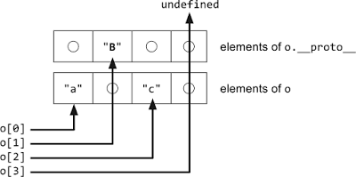

<slide class="bg-white aligncenter">
# **数组 -- 连续 or 缺省**
---

* #### 连续数组 V8 会以紧凑型数组存储，性能较好。 --- 快速模式
* #### 缺省数组，空洞数量过多时，V8会用空间换性能，切换至 Map 存储。 --- 字典模式

<slide class="bg-white aligncenter">
# **Array 总结和建议**
---

*  #### 数量超过10的数组排序时，如对稳定性有要求，自行实现排序。 {.animated.fadeInUp.delay-200 }
*  #### 数组尽量不要太大，保持紧凑的，减少空洞，维持数组在快速模式。 {.animated.fadeInUp.delay-400 }

<slide class="bg-white aligncenter">
# **方法 -- Function**

<slide class="bg-white size-80 aligncenter">
#### **方法 -- Function**
---

``` javascript
const arr1 = [];
for (let i = 0; i < 10000000; ++i) {
  arr1.push({
    add(x, y) {
      return Math.pow(x, y) * Math.pow(x, y) * Math.pow(x, y);
    }
  });
}

for (let i = 0; i < 10000000; ++i) {
  arr1[0].add(i, i + 1);
}
```

---

``` javascript
const arr1 = [];
for (let i = 0; i < 10000000; ++i) {
  arr1.push({
    add(x, y) {
      return Math.pow(x, y) * Math.pow(x, y) * Math.pow(x, y);
    }
  });
}

for (let i = 0; i < 10000000; ++i) {
  arr1[i].add(i, i + 1);
}
```

<slide class="bg-white aligncenter">
# V8 内联缓存
--- 

* #### 编译性语言：代码段 -> 语法树 -> 中间码 -> 机器语言
* #### 解析性语言：代码段 -> 语法树 -> 机器语言

<slide class="bg-white size-50 aligncenter">
# V8 内联缓存
--- 

``` javascript
const codeCache = [];

function runJsCode(code) {
  if (code in codeCache) {
    codeCache[code].run();
  } else {
    code.run();
    codeCache.push(code);
  }

  if (codeCache > "特定值") {
    codeCache.shift();
  }
}
```

<slide class="bg-white aligncenter">
# **Function 总结和建议**
---

#### V8 会对最近使用的代码片段，进行缓存，以增加下次执行效率。 {.animated.fadeInUp.delay-200 }

---

*  #### 优先执行重复相同的方法。 {.animated.fadeInUp.delay-400 }

<slide class="bg-white aligncenter">
# 最后总结
--- 

### **对象-Object** {.animated.fadeInUp.delay-200 }
*  #### 尽量保持相同的属性顺序 {.animated.fadeInUp.delay-200 }
*  #### 尽量不动态添加属性 {.animated.fadeInUp.delay-200 }

--- 
### **数组-Array** {.animated.fadeInUp.delay-400 }
*  #### 数量超过10的数组排序时，如对稳定性有要求，自行实现排序。 {.animated.fadeInUp.delay-400 }
*  #### 数组尽量不要太大，保持紧凑的，减少空洞，维持数组在快速模式。 {.animated.fadeInUp.delay-400 }

--- 
### **方法-Function** {.animated.fadeInUp.delay-600 }
*  #### 优先执行重复相同的方法。 {.animated.fadeInUp.delay-600 }